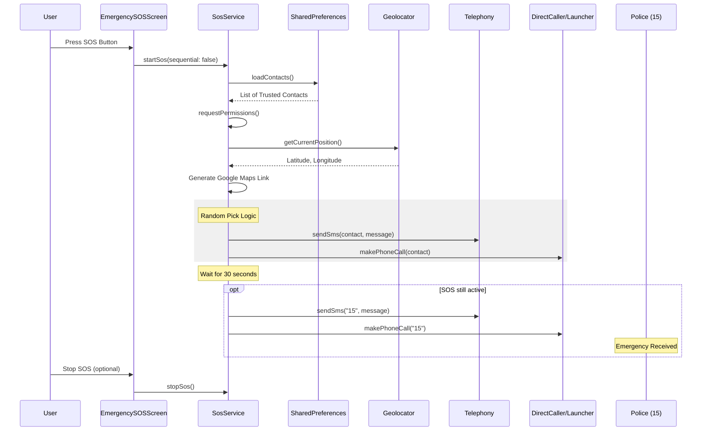
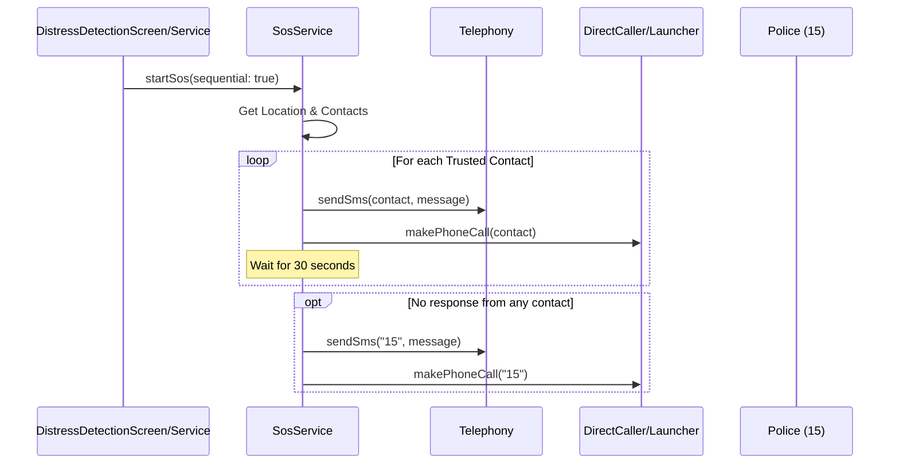

```mermaid
sequenceDiagram
    participant User
    participant UI as EmergencySOSScreen
    participant SOS as SosService
    participant LocalStorage as SharedPreferences
    participant GPS as Geolocator
    participant SMS as Telephony
    participant Dialer as DirectCaller/Launcher
    participant Police as Police (15)

    User->>UI: Press SOS Button
    UI->>SOS: startSos(sequential: false)
    SOS->>LocalStorage: loadContacts()
    LocalStorage-->>SOS: List of Trusted Contacts
    SOS->>SOS: requestPermissions()
    SOS->>GPS: getCurrentPosition()
    GPS-->>SOS: Latitude, Longitude
    SOS->>SOS: Generate Google Maps Link
    
    rect rgb(240, 240, 240)
        Note over SOS: Random Pick Logic
        SOS->>SMS: sendSms(contact, message)
        SOS->>Dialer: makePhoneCall(contact)
    end

    Note over SOS: Wait for 30 seconds

    opt SOS still active
        SOS->>SMS: sendSms("15", message)
        SOS->>Dialer: makePhoneCall("15")
        Note over Police: Emergency Received
    end

    User->>UI: Stop SOS (optional)
    UI->>SOS: stopSos()
```

```mermaid
sequenceDiagram
    participant System as DistressDetectionScreen/Service
    participant SOS as SosService
    participant SMS as Telephony
    participant Dialer as DirectCaller/Launcher
    participant Police as Police (15)

    System->>SOS: startSos(sequential: true)
    SOS->>SOS: Get Location & Contacts
    
    loop For each Trusted Contact
        SOS->>SMS: sendSms(contact, message)
        SOS->>Dialer: makePhoneCall(contact)
        Note over SOS: Wait for 30 seconds
    end

    opt No response from any contact
        SOS->>SMS: sendSms("15", message)
        SOS->>Dialer: makePhoneCall("15")
    end
```
